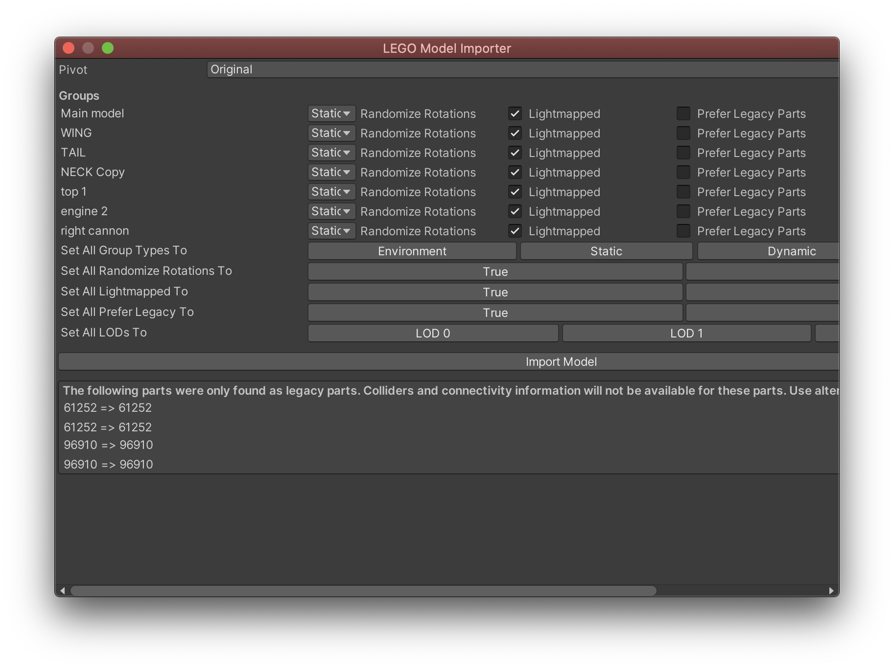
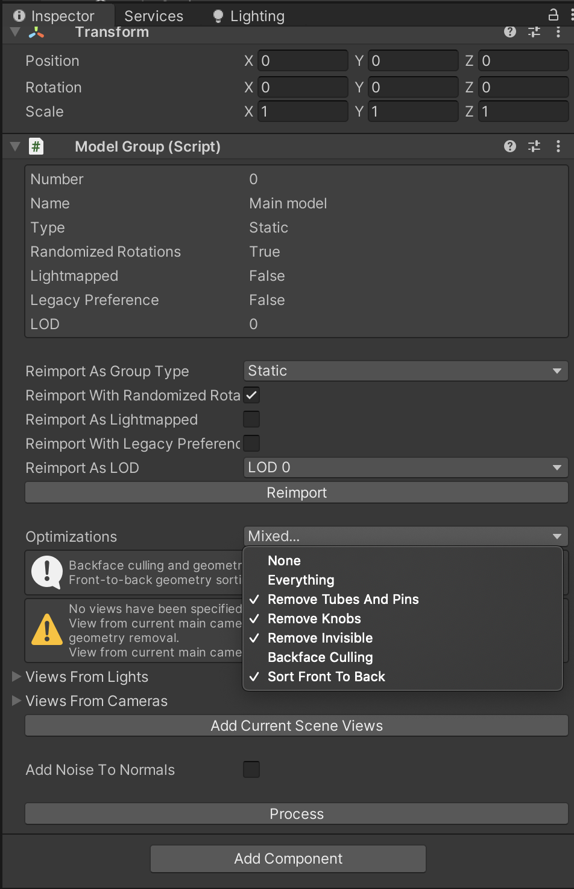

# About

The purpose of LEGO Model Importer is to help you import LEGO models into Unity or build new models using our Connectivity System.

## Installation

LEGO Model Importer can be installed using the Unity Package Manager.

If you do not have **Universal Render Pipeline** installed, the package will ask if you want to enable it when installed.

## Requirements

The package has a dependency to LEGO Materials.

This package is written for and tested with **Universal Render Pipeline** and **Unity 2020.2+**

## How To

The LEGO Model Importer has 3 main features; Importing models, Optimization and Connectivity.

### Importing Models

The LEGO Model Importer can work with various file formats that describe a LEGO model; LXFML, LDR and IO files.

Recommendation is to start building your model in [Bricklink Studio](https://www.bricklink.com/v3/studio/download.page).

All geometry files are contained in the package, but you might encounter files missing depending on the model you have built.
We suggest using Bricklink Studio for importing as it contains a brick palette we ensure matches the internal brick database of this package.

From the LEGO menu section, select Import Model and find the file you want to import. After selecting the file you will see the import dialogue popup with various options:

Import Settings
- Pivot: Calculate a new pivot point for your model
- Groups: See all the groups for your model and select import settings for each
- Type: Environment, Static and Dynamic sets the default optimzations for the model or group
- Import Issues: Highlights missing elements

### Optimize a model

A LEGO model can contain a lot of bricks and therefore a lot of vertices that will impact performance significantly.

We have there put in a few optimzation options for you to chose from. Select the group or model you want to optimize in the Hierarchy and you will find all settings in the inspector:

Optimizations:
- Remove Tubes and Pins
- Remove Knobs
- Remove Invisible
- Backface Culling (multiple cameras can be set in the scene view)
- Sort Front to Back

### Connectivity

The Model Importer supports basic connectiviy logic to move and snap bricks together in the scene view.

It currently doesn't support all connectivity types but will evolve over time. You can select connectivity on/off in the Scene View UI.

The Connectivity System utilize a few shortcuts that you can find in the shortcut manager. 
